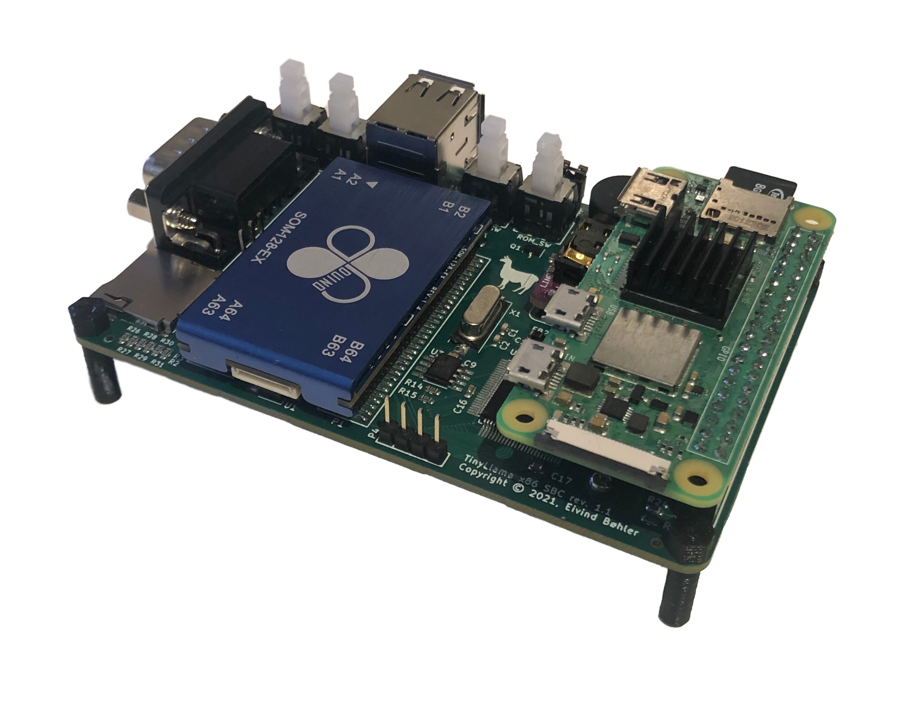
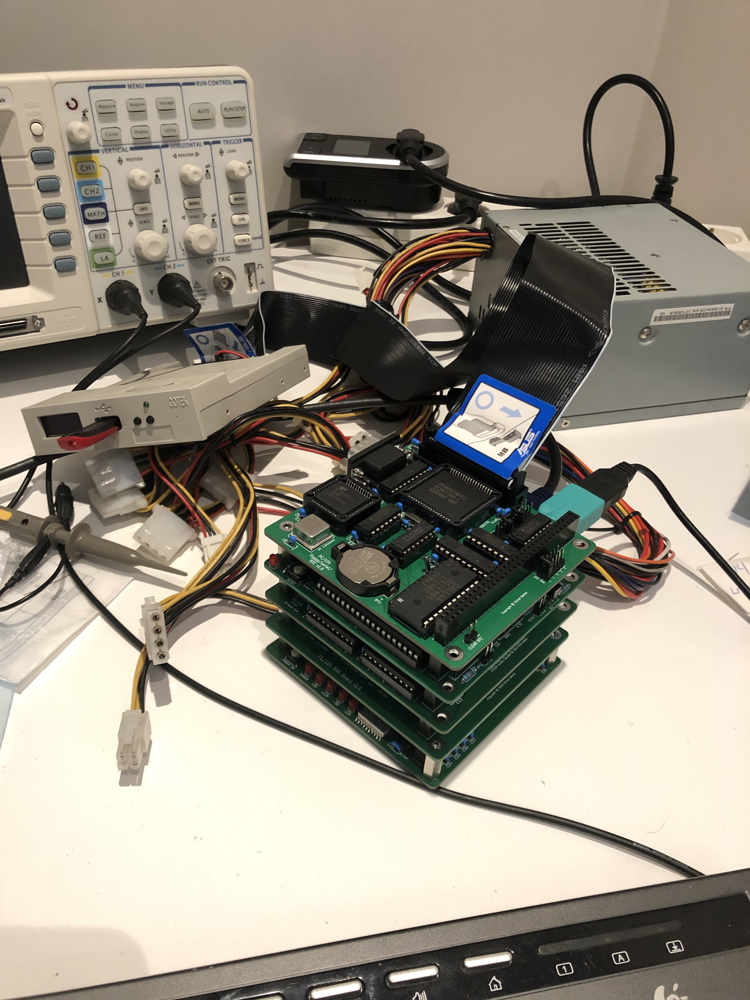
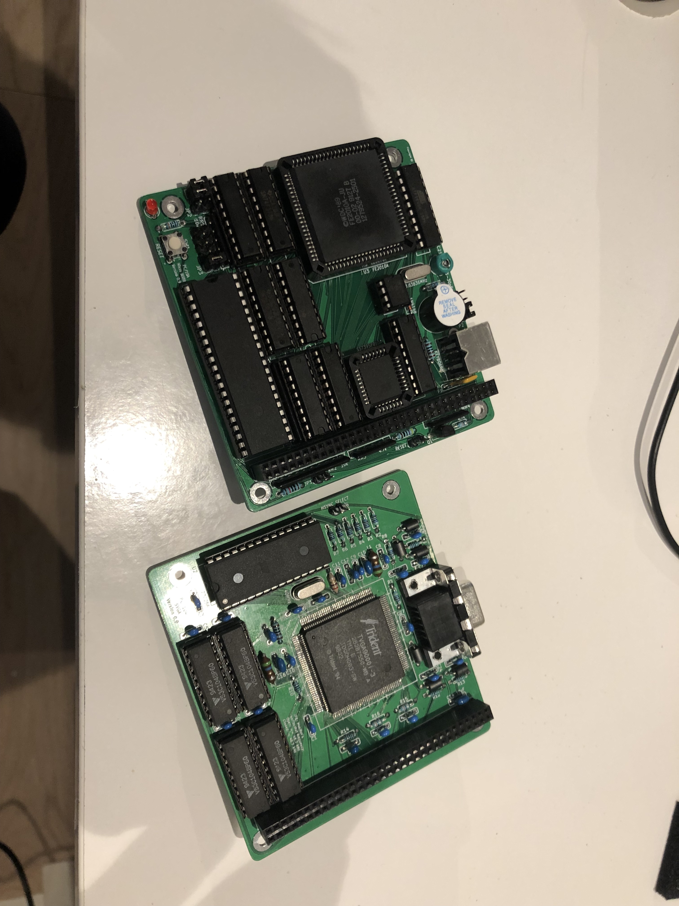
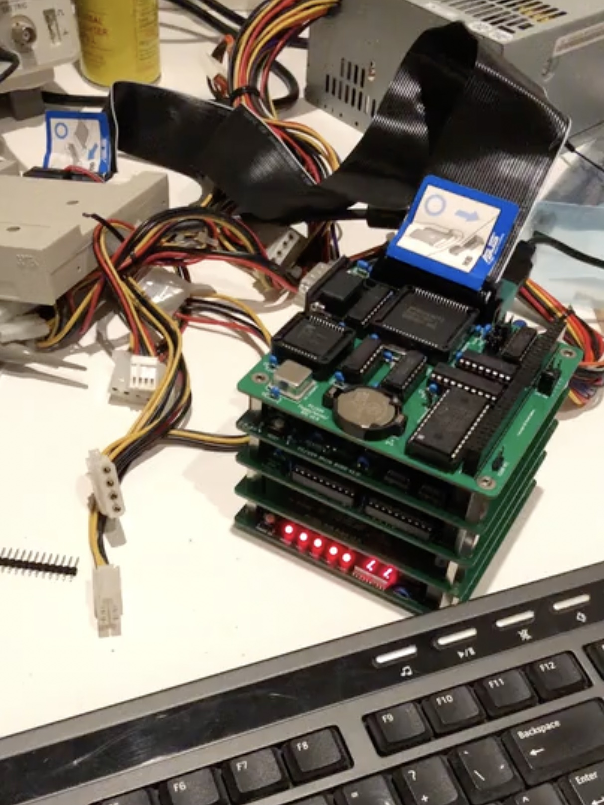

<div id="summary" align="center">
  
</div>



<br/>
<br/>

- A fully-fledged 486/Pentium-class PC in a tiny form factor
- Integrated Sound Blaster Pro-compatible audio
- Add a Raspberry Pi Zero 2 for Roland MT-32 and General MIDI music
- Open-source hardware schematics, board layout and BIOS - build your own!
- Perfect for playing DOS games!
- [YouTube feature](https://www.youtube.com/watch?v=iFZJjNTxgu8)

<br/>

## Table of Contents
- [Summary](#summary)
- [Project Goals](#project-goals)
- [History](#history)
- [Full system specs](#full-system-specs-revision-11)
- [Building](#building)
  * [Sourcing Parts](#sourcing-parts)
  * [Assembly](#assembly)
  * [Programming the BIOS](#programming-the-bios)
  * [Installing DOS](#installing-dos)
  * [Programming the CS4237B Firmware](#programming-the-cs4237b-firmware)
- [Wiki](#wiki)
- [Help](#help)
- [Roadmap](#roadmap)
- [Contributing](#contributing)
- [License](#license)
- [Contact](#contact)
- [Acknowledgements](#acknowledgments)

<br/>

## Project Goals
The goal of the TinyLlama project is:
- To create a fully x86-compatible DIY DOS computer with a sound card
- To keep the size as small as possible while keeping decent connectivity
- To keep the cost low

## History
While I regularly use and enjoy real hardware from the 80's and early 90's - this stuff is often hard to get hold of, expensive, large, heavy, unreliable and proprietary.

In 2019 this made me look into modern recreations of old hardware, and I came across [Sergey Kiselev][sergeys-projects]'s fantastic [Micro 8088][micro-8088] and various peripheral board designs.
Wanting a challenge, I modified most of these into the [PC/104][pc-104] form factor and successfully made a few prototypes:

<div>
<a href="https://github.com/eivindbohler/tinyllama/blob/main/images/pc104_1.jpg"></a>
<a href="https://github.com/eivindbohler/tinyllama/blob/main/images/pc104_2.jpg"></a>
<a href="https://github.com/eivindbohler/tinyllama/blob/main/images/pc104_3.mp4"></a>
</div>
<br />

However, being born in the early 80's and growing up playing games on 386/486-era computers, I started searching for similar projects with later hardware - and couldn't really find any. I discovered industrial boards and modules with varying degrees of ISA expandability, but these were all wildly expensive.

Then, I found the [86Duino][86duino] line of products from [DMP][dmp].  
The cheap 86Duino hardware, tailored for robotics tinkerers, seemed like a promising path. I ordered a few boards and system-on-modules and made a [prototype carrier board][hafima-image-one] with break-out ISA header pins. I intended to build an add-on sound card board, but this just proved too complex at the time, and I abandoned the project.

Fast-forward to 2021, and I saw [Rasteri's YouTube videos][rasteri-videos] detailing his experiments using different Vortex86-based industrial boards and modules, and most importantly how easy it was to utilize the powerful (and still readily available) Sound Blaster Pro-compatible Crystal CS4237B sound chip.

As fate wanted it, The Raspberry Pi Foundation had just released their Zero 2 W board, and I thought if I could put [Dale Whinham's fantastic MT32-Pi][mt32-pi] bare-metal MT-32 / General MIDI synth software on it, I would be very close to my DIY dream DOS computer.

The TinyLlama and this GitHub repo is the result.

## Full system specs (revision 1.1)
### Hardware
- **86Duino System-on-module**
  * Vortex86EX CPU running at 60-500 MHz
  * 16 KB L1 cache (can be disabled)
  * 128 KB L2 cache
  * 128 MB DDR3 RAM
  * 8 MB programmable flash ROM
- **Vortex86VGA module running off a x1 PCI-e lane**
  * Maximum resolution: 1024x768, 60 Hz
  * 4 MB SRAM
- **Crystal CS4237B all-in-one audio chip**
- **12mm PC-speaker**
- **CR1220 battery for persistent real-time clock**
- **Power and reset buttons**
- **Connectivity**
  * USB Micro-B for power (draws ~4.5W with a Pi attached, ~3W without, depending on CPU frequency)
  * 2 x USB Type-A 2.0 connectors for keyboard/mouse/storage
  * MicroSD slot for storage
  * DE-9 RS232 serial port (COM1)
  * Internal 3-pin TTL serial connector (COM2)
  * Internal 2-pin power connector for a fan (5V or 3.3V selectable)
  * 3.5mm line-out audio jack
- **MT32-Pi subsystem**
  * 40-pin connector for a Raspberry Pi Zero 2
  * 9 holes for attaching a GY-PCM5102 I²S DAC module
  * Button for toggling between MT32/General MIDI mode
  * Button for switching between audio ROM's / soundbanks
  * 4-pin I²C connector for an OLED display

### Software
- **[Custom Coreboot/SeaBIOS ROM][bios]**
- **MS-DOS / FreeDOS**

## Building
### Sourcing Parts
Full BOM (bill of materials) can be found [in the wiki][wiki-bom].
- The TinyLlama PCB
- Modern SMD and through-hole components, as seen in the BOM
- 86Duino system-on-module (SOM-128-EX)
- Vortex86VGA Mini PCI-e module
- Crystal CS4237B 100-pin TQFP. Discontinued, but readily available
- A CR1220 battery if you want persistent real-time clock
- One or more USB flash drives and/or a microSD card
- A Micro USB-B power adapter (minimum 2A)

#### For MT-32/MIDI - optional, but highly recommended
- GY-PCM5102 DAC module
- Raspberry Pi Zero 2 W with a microSD card
- An [mt32-pi compatible OLED display][mt32-pi-oled] (you don't really need it, but it's a nice addition)


### Assembly
Solder all components onto the TinyLlama PCB. As always, it's easier to start with the low-profile ones first, like resistors and capacitors.
If you're willing to spend slightly more, I recommended you let the PCB manufacturer pre-assemble most of the common components for you. Plus, some of the SMD components can be fairly tricky to solder without solder paste and a heat gun (or even better, a reflow oven).  
Take a look at the [wiki][wiki-assembly] for more in-depth assembly instructions.

### Programming the BIOS
When purchasing the SOM-128-EX module from DMP, its ROM chip is preinstalled with an Arduino-like bootloader which is useless to us. Also, the  "crossbar" is configured for using the module with the 86Duino Zero/One boards - meaning its default pin layout is completely different from what we need for the TinyLlama.

Follow these steps to flash the ROM with the TinyLlama BIOS for the first time:
1. Find a USB flash drive, must be minimum 32 MB in size (shouldn't be a problem these days). Note that not all USB drives are bootable. Use a well-known bootable drive.
2. Unzip the `INITBIOS.ZIP` file from this GitHub repo and do a block-level transfer of the `INITBIOS.IMG` to the USB drive. Use [Balena Etcher][balena-etcher], or the command line if you know what you're doing (macOS example):
```
$ diskutil list
(Find your USB drive, eg. /dev/disk2)
$ diskutil unmountDisk /dev/disk2
$ sudo dd if=INITBIOS.IMG of=/dev/rdisk2 bs=1m
```
3. Insert the flash drive into the TinyLlama and turn it on. You should be able to enter the boot menu using F12. Select the USB drive and boot into a stripped-down FreeDOS installation. Then, to flash the ROM, type:
```
C:\>anybios w initbios.rom
```
...and reboot.
For subsequent BIOS updates, you can use the built-in BIOS updater selection available from the boot menu (press F12). This will boot into the same minimal FreeDOS installation, but from the virtual floppy drive integrated into the ROM itself.  
From there you'll only need a USB stick formatted as FAT16/FAT32 with the new BIOS file.

### Installing DOS
1. Format a microSD card or USB flash drive as a FAT32 partition with a MBR (Master Boot Record).
2. Insert it, turn on the system, press F12 to bring up the boot menu, and select the "TinyLlama BIOS updater".
3. Use `fdisk` from the command prompt to partition the SD/USB drive and set it to be `Active`.
4. Reboot and re-enter the BIOS updater boot environment. Use `format c: /s` to format the drive and copy over system files. Finally use `fdisk /mbr` to make sure the Master Boot Record is correct and the drive should be bootable.
5. Shut down the TinyLlama, eject the drive and copy over FreeDOS from another computer. I suggest putting FreeDOS in the `\FDOS` directory.
6. Set up appropriate `FDCONFIG.SYS` and `FDAUTO.BAT` files (FreeDOS equivalent versions of `CONFIG.SYS` and `AUTOEXEC.BAT`). Look at the [wiki][wiki-configuration] for examples.

### Programming the CS4237B Firmware
1. Copy the `CS4237B` and `UNISOUND` folders from this GitHub repo over to the SD/USB drive and start the system.
2. To program the firmware, run the `RESOURCE.EXE` command below and check that you get the same output:
```
C:\>cd cs4237b
C:\CS4237B>resource /f=0x120 /r=cs4237b.asm /e

Reading data from CS4237B.ASM
Length = 292    Programming EEPROM Block: 1 2    EEPROM programmed

Verifying EEPROM:
Verifying CS4237B.ASM against EEPROM . . .      Verified OKAY
```
3. Reboot the system, set a `BLASTER` environment variable and run `UNISOUND.EXE`; you should get the following output:
```
C:\>set BLASTER=A220 I7 D1 P330 T4
C:\>cd unisound
C:\UNISOUND>unisound
Universal ISA PnP Sound Card Driver for DOS v0.76f. (c) JazeFox 2019-21
-----------------------------------------------------------------------
PnP card found: [CSC7537] CS4237B
BLASTER environment var found! Loading settings...
ADD:220 WSS:534 OPL:388 IRQ:7 DMA:1/1 MPU:330/I9 CTR:120 JOY:200
Initialization done.
Crystal Mixer [VOL:85 WAV:80 FM:80 LIN:0 CD:0 MIC:0]
```
4. If everything went ok, add the `BLASTER` variable and `UNISOUND` command to your `FDAUTO.BAT`/`AUTOEXEC.BAT` file:
```
SET BLASTER=A220 I7 D1 P330 T4
C:\UNISOUND\UNISOUND.EXE /V60 /VW60 /VF60 /VL60 /VP60 /VC0 /VM0
```
5. Feel free to experiment with the different volume levels, look at the `C:\UNISOUND\UNISOUND.TXT` file for further guidance.
6. Fire up a few games to test that Adlib, SoundBlaster FM and Digital sound effects are working properly.

## Wiki
For an in-depth discussion of the various components, installation, configuration, etc, take a look at the [wiki][wiki].

## Help
This project is mostly indended for people with a fair bit of hardware- and DOS knowledge. If you have questions or need help, please look at the [wiki][wiki] and [FAQ][wiki-faq] section first.

## Roadmap
Coming.  
In the mean time feel free to post [an issue][issues] if you have tips, suggestions or want to report an error.

## License
[GNU General Public License v3.0](LICENSE)

## Contact
[Vogons thread][vogons-thread]  
[@eivindbohler][twitter]

## Acknowledgements

Many thanks to
- [Sergey Kiselev][sergeys-projects] for a fantastic open-source suite of DIY computers, and sparking my interest in designing and building these myself.
- [Rasteri][rasteri-videos] for his cool videos about small DOS computers and the CS4237B chip.
- [The Vogons forum][vogons] for inspiration, help and support.
- [86Duino][86duino] for making a kick-ass system-on-module at an affordable price.
- [Dale Whinham / mt32-pi][mt32-pi] for making the best synth emulator software package ever.

[sergeys-projects]: http://www.malinov.com/Home/sergeys-projects
[micro-8088]: https://github.com/skiselev/micro_8088
[pc-104]: https://en.wikipedia.org/wiki/PC/104
[86duino]: https://www.86duino.com
[dmp]: https://www.dmp.com.tw
[hafima-image-one]: images/hafima2_1.jpg
[rasteri-videos]: https://www.youtube.com/user/TheRasteri/videos
[mt32-pi]: https://github.com/dwhinham/mt32-pi
[mt32-pi-oled]: https://github.com/dwhinham/mt32-pi/wiki/LCD-and-OLED-displays
[wiki]: https://github.com/eivindbohler/tinyllama/wiki
[wiki-assembly]: https://github.com/eivindbohler/tinyllama/wiki/assembly
[wiki-bom]: https://github.com/eivindbohler/tinyllama/wiki/bom
[wiki-faq]: https://github.com/eivindbohler/tinyllama/wiki/faq
[wiki-configuration]: https://github.com/eivindbohler/tinyllama/wiki/configuration
[balena-etcher]: https://www.balena.io/etcher
[issues]: https://github.com/eivindbohler/tinyllama/issues
[vogons]: https://www.vogons.org
[vogons-thread]: https://www.vogons.org/viewtopic.php?t=84880
[twitter]: https://twitter.com/eivindbohler
[bios]: https://github.com/eivindbohler/tinyllama-bios